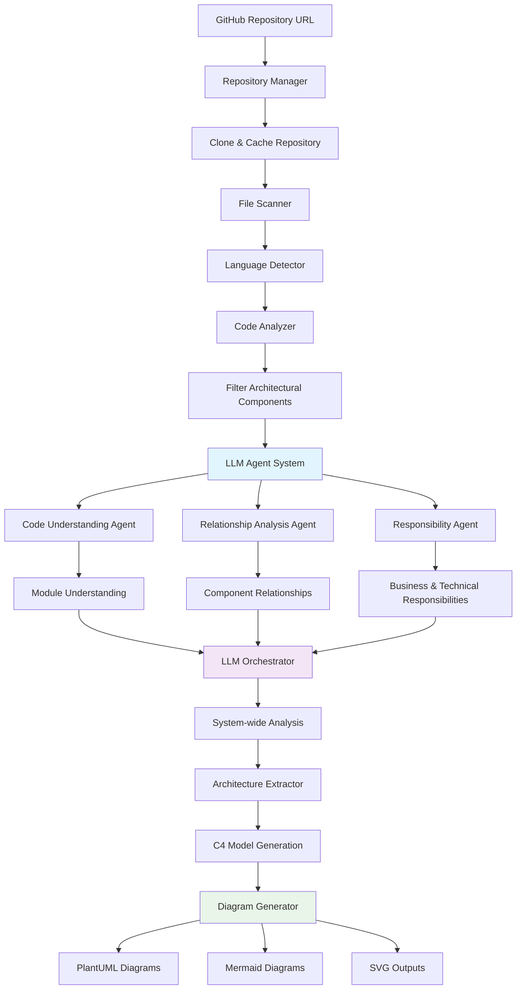

# C4 Diagram Generator

An intelligent system for automatically generating C4 architecture diagrams from source code using AI-powered analysis with Large Language Models (LLMs).

## 🔄 System Flow & Architecture



### 📊 Processing Pipeline

1. **Repository Ingestion** → Clone and cache GitHub repositories locally
2. **Code Parsing** → Scan files and detect programming languages
3. **Component Analysis** → Filter architectural components (exclude tests, configs)
4. **LLM Analysis** → Multi-agent AI system analyzes code structure
5. **Relationship Mapping** → Extract dependencies and interactions
6. **C4 Generation** → Create Context, Container, and Component diagrams

## Features

- **🤖 AI-Powered Analysis**: Uses CodeLlama and OpenAI for intelligent code understanding
- **🔍 Multi-Agent System**: Specialized LLM agents for different analysis tasks
- **🌐 Multi-source Support**: GitHub, GitLab, and Apache Software Foundation repositories
- **🗣️ Language Agnostic**: Supports Python, Java, JavaScript/TypeScript, C++, Go, and more
- **📋 Automated C4 Diagrams**: Generates Context, Container, and Component level diagrams
- **🔗 Smart Dependency Mapping**: AI-driven extraction of architectural relationships
- **⚡ Intelligent Caching**: Efficient repository caching and incremental analysis
- **🎨 Multiple Output Formats**: PlantUML, Mermaid, and SVG diagram generation

## Project Structure

```
├── codebase_parser/              # Repository parsing and code analysis
│   ├── repository_manager.py    # GitHub/GitLab repository handling
│   ├── file_scanner.py          # Intelligent file discovery and filtering
│   ├── language_detector.py     # Multi-language detection and analysis
│   └── code_analyzer.py         # Code structure and dependency analysis
├── architecture_extractor/      # AI-powered architecture analysis
│   ├── architecture_analyzer.py # Main architecture extraction logic
│   ├── semantic_analyzer.py     # Semantic code understanding
│   └── llm_agents/             # Specialized LLM agent system
│       ├── llm_client.py        # LLM communication (Ollama/OpenAI)
│       ├── code_understanding_agent.py  # Code structure analysis
│       ├── relationship_analysis_agent.py  # Component relationships
│       ├── responsibility_agent.py      # Business/technical responsibilities
│       └── llm_orchestrator.py         # Multi-agent coordination
├── diagram_generator/           # C4 diagram generation and formatting
│   ├── c4_generator.py         # Core C4 model creation
│   ├── c4_models.py           # C4 architecture model definitions
│   └── diagram_formatters.py  # PlantUML/Mermaid/SVG output
├── config/                     # Configuration and settings
├── cache/                      # Repository cache and artifacts
└── output/                     # Generated diagrams and analysis results
```

## 🔧 LLM Agent System Architecture

The system uses a sophisticated multi-agent LLM architecture for comprehensive code analysis:

### 🧠 Agent Responsibilities

1. **Code Understanding Agent**
   - Analyzes module purpose and responsibilities
   - Identifies C4 classification (Component, Container, etc.)
   - Extracts interfaces provided and consumed
   - Determines business rules and technical concerns

2. **Relationship Analysis Agent**
   - Maps component dependencies and interactions
   - Identifies API calls, database connections
   - Analyzes coupling levels and integration complexity
   - Provides evidence-based relationship mapping

3. **Responsibility Agent**
   - Separates business vs. technical responsibilities
   - Identifies stakeholders and business capabilities
   - Maps quality attributes and compliance requirements
   - Analyzes change drivers and risk factors

4. **LLM Orchestrator**
   - Coordinates all agents for system-wide analysis
   - Performs cross-cutting concern analysis
   - Identifies responsibility conflicts
   - Generates architectural recommendations

### 🔄 Analysis Flow Details

```
┌─────────────────┐    ┌──────────────────┐    ┌─────────────────────┐
│   Repository    │────│  File Scanner &  │────│   Code Analyzer     │
│   Manager       │    │  Language Detect │    │   & Component       │
└─────────────────┘    └──────────────────┘    │   Classification    │
                                               └─────────────────────┘
                                                          │
                                               ┌─────────────────────┐
                                               │   LLM Agent         │
                                               │   Orchestrator      │
                                               └─────────────────────┘
                                                          │
              ┌───────────────────────────────────────────┼───────────────────────────────────────────┐
              │                                           │                                           │
    ┌─────────────────────┐                    ┌─────────────────────┐                    ┌─────────────────────┐
    │ Code Understanding  │                    │ Relationship        │                    │ Responsibility      │
    │ Agent               │                    │ Analysis Agent      │                    │ Agent               │
    │                     │                    │                     │                    │                     │
    │ • Module purpose    │                    │ • Dependencies      │                    │ • Business logic    │
    │ • C4 classification │                    │ • API calls         │                    │ • Technical concerns│
    │ • Interfaces        │                    │ • Coupling analysis │                    │ • Stakeholders      │
    │ • Business rules    │                    │ • Integration flows │                    │ • Quality attributes│
    └─────────────────────┘                    └─────────────────────┘                    └─────────────────────┘
              │                                           │                                           │
              └───────────────────────────────────────────┼───────────────────────────────────────────┘
                                                          │
                                               ┌─────────────────────┐
                                               │   System Analysis   │
                                               │   & C4 Model        │
                                               │   Generation        │
                                               └─────────────────────┘
                                                          │
                                               ┌─────────────────────┐
                                               │   Diagram           │
                                               │   Generator         │
                                               │                     │
                                               │ • PlantUML          │
                                               │ • Mermaid           │
                                               │ • SVG               │
                                               └─────────────────────┘
```

## Quick Start

### Prerequisites

1. **Install Python Dependencies**:
```powershell
pip install -r requirements.txt
```

2. **Setup LLM Environment** (Optional but Recommended):
```powershell
# Install Ollama for local LLM support
# Download from: https://ollama.ai/
ollama pull codellama:7b-instruct
```

3. **Set OpenAI API Key** (Optional Fallback):
```powershell
$env:OPENAI_API_KEY = "your-api-key-here"
```

### Basic Usage

```powershell
# Analyze a GitHub repository with full LLM analysis
python main_github.py https://github.com/microsoft/vscode --output ./output --verbose

# Quick analysis without LLM (faster but less detailed)
python main_github.py microsoft/vscode --no-enable-llm --output ./diagrams

# Target specific languages only
python main_github.py django/django --languages python --enable-llm

# Custom LLM configuration
python main_github.py spring-projects/spring-boot --llm-model codellama:13b-instruct --llm-url http://localhost:11434
```

### Command Line Options

```
Usage: python main_github.py [OPTIONS] GITHUB_REPO_URL

Options:
  -o, --output TEXT           Output directory (default: ./output)
  -c, --cache-dir TEXT        Cache directory (default: ./cache)
  -f, --force-refresh         Force refresh cached repository
  -l, --languages TEXT        Target languages (e.g., python,java,javascript)
  -v, --verbose              Enable detailed output
  --enable-llm/--no-enable-llm    Enable AI analysis (default: enabled)
  --llm-model TEXT           LLM model (default: codellama:7b-instruct)
  --llm-url TEXT             LLM API URL (default: http://localhost:11434)
  --generate-diagrams/--no-generate-diagrams    Generate C4 diagrams (default: enabled)
  --diagram-formats TEXT     Output formats (default: plantuml,mermaid)
  --diagram-theme TEXT       Visual theme (default,dark,corporate,minimal)
  --skip-architecture        Skip detailed architecture analysis
  --skip-semantic            Skip semantic analysis
```

### Output Structure

After running the analysis, you'll find:

```
output/
├── analysis_results.json          # Complete analysis data
├── diagrams/
│   ├── context_diagram.puml       # C4 Context diagram
│   ├── container_diagram.puml     # C4 Container diagram
│   ├── component_diagram.puml     # C4 Component diagram
│   ├── context_diagram.mermaid    # Mermaid format
│   └── *.svg                      # SVG renderings
└── reports/
    ├── component_analysis.md      # Detailed component breakdown
    ├── relationship_mapping.md    # Dependency analysis
    └── architectural_insights.md  # AI-generated insights
```

## 🧠 AI-Powered Analysis Details

### LLM Integration Points

The system makes strategic use of LLMs through specialized prompts:

1. **Module Understanding Prompts**
   - "What is the main purpose and responsibility?"
   - "How does it fit in C4 architecture (Component, Container, etc.)?"
   - "What interfaces does it provide to other components?"
   - "What business logic does it implement?"

2. **Relationship Analysis Prompts**
   - "Identify direct relationships (uses, depends_on, implements, extends)"
   - "Analyze import/dependency statements and function calls"
   - "Map API endpoints consumed or provided"
   - "Assess integration complexity and coupling levels"

3. **Responsibility Analysis Prompts**
   - "What business capabilities does this component enable?"
   - "What technical capabilities does it provide?"
   - "What quality attributes are important (performance, security, etc.)?"
   - "What are its integration responsibilities?"

### API Usage Summary

- **5 Total API Endpoints**: GitHub API, Ollama Health Check, Ollama Generation, OpenAI API, PlantUML Resources
- **Per Repository Analysis**: 3+ API calls minimum
- **Per Component Analysis**: 4-7 LLM calls for comprehensive understanding
- **Large Repository (10+ components)**: 40-50+ total API calls
- **Smart Caching**: Reduces redundant API calls through intelligent caching

## Architecture

The system consists of four main components working in harmony:

1. **🔍 Codebase Parser**: Intelligent repository analysis and code discovery
   - Multi-source repository support (GitHub, GitLab, Apache)
   - Language-agnostic parsing with tree-sitter integration
   - Smart file filtering and component classification

2. **🤖 Architecture Extractor**: AI-powered semantic analysis
   - Multi-agent LLM system for comprehensive understanding
   - Business and technical responsibility mapping
   - Cross-cutting concern identification

3. **📊 Diagram Generator**: Professional C4 diagram creation
   - Multiple output formats (PlantUML, Mermaid, SVG)
   - Customizable themes and styling options
   - Automated layout optimization

4. **⚡ Intelligent Orchestration**: Coordinated analysis pipeline
   - Fallback mechanisms for robust operation
   - Confidence scoring and quality metrics
   - Incremental analysis and caching

## Supported Repository Sources

- ✅ **GitHub** public repositories (primary focus)
- ✅ **GitLab** projects (planned)
- ✅ **Apache Software Foundation** projects (planned)
- ✅ **Local repositories** (file system)

## Supported Languages

- 🐍 **Python** (fully supported)
- ☕ **Java** (fully supported)
- 🟨 **JavaScript/TypeScript** (fully supported)
- ⚡ **C++** (supported)
- 🐹 **Go** (supported)
- 🦀 **Rust** (planned)
- 💎 **Ruby** (planned)
- 🔷 **C#** (planned)

## Performance & Scalability

- **🚀 Smart Filtering**: Focuses on architectural components, ignores test/config files
- **📦 Intelligent Caching**: Repository-level caching for faster subsequent analyses
- **🔄 Incremental Analysis**: Only re-analyzes changed components
- **⚖️ Load Balancing**: Distributes LLM requests to avoid rate limiting
- **📊 Batch Processing**: Efficient handling of large codebases

## Contributing

We welcome contributions! Please see our [Contributing Guidelines](CONTRIBUTING.md) for details.

1. Fork the repository
2. Create a feature branch (`git checkout -b feature/amazing-feature`)
3. Commit your changes (`git commit -m 'Add amazing feature'`)
4. Push to the branch (`git push origin feature/amazing-feature`)
5. Open a Pull Request

## License

MIT License
"# ArchitectureDiscovery-Backend" 
